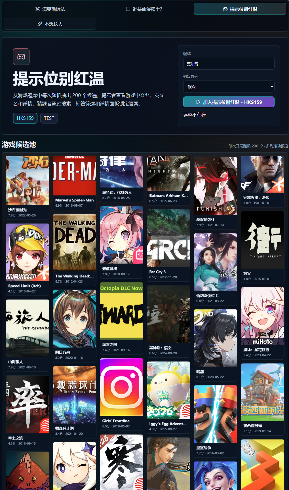

# 双音节对抗

实时组队猜题网页游戏，支持四种玩法：

- `海克斯玩法`
- `谁是动漫糕手？`
- `提示位别红温`
- `不想长大`

玩家只需要浏览器和四位数字房间号即可即刻入场，支持多人即时组队对抗。

公网直接访问地址：[http://39.105.218.65/](http://39.105.218.65/)

*注：当前公网仅提供 HTTP 服务，浏览器显示“不安全”为正常现象。*

⏰ **服务器自动开关服**：每天中午 **12:00** 自动开服，凌晨 **02:00** 自动关服。

---

## 🚀 快速开始

1. 输入您的**玩家昵称**。
2. 输入您想加入的**四位数字房间号**（例如 `1234`；或者输入内置测试房号 `TEST`）。
3. 点击 **“创建或加入房间”**，即可即时入场！
4. 成功加入后，可在房间内选择空闲席位准备开战。

---

## 🔑 核心规则与权限说明

### 1. 免密登录与快捷建房
* **完全免密公开**：移除了所有注册、登录、访问账号、密码及算术验证码门槛。玩家直接输入昵称及房间号即可加入。
* **动态房间生命周期**：
  * 支持玩家输入任意 `四位数字` 的房间号进行动态建房。
  * **自动清理机制**：当房间内的所有玩家均断开连接（如关掉网页、主动退出）且房间内无任何在线玩家时，该房间及房间号将会在后端内存中**自动销毁并从列表中清除**。

### 2. 首位创建人即为 Host（先到先得）
* 移除了过往写死的“管理员/主持人”鉴权。
* **谁先进入新房间（即该房间的第一位创建者/加入者），谁就自动被指定为该房间的“主持人 (Host)”**。
* **主持人自动推选/转接机制**：若当前主持人在游戏中途断开连接或退出房间，**后端会在剩下的在场在线玩家中自动推选第一个人接替成为新的主持人**，避免房间卡死或无法开局。

### 3. 多人组队与席位
* **两队对抗**：迅捷蟹队 vs 石甲虫队。
* **席位结构**：每队最多 5 名参赛者（1 名提示者 + 最多 4 名猜题者），支持 2v3、2v4、5v5 等不对称阵容对抗。
* **开局条件**：两队各至少有 1 名提示者和 1 名猜题者入座，且所有参赛者点击“准备”后，游戏将自动开始；主持人也可随时在面板中手动开局。

### 4. 共享提示与回合逻辑
* 当前队伍的提示者提交双音节提示，猜题者在候选列表中选中提交。**双方队伍共享全部提示**。
* 提示者提交提示时，支持 **“叠层”**、**“平a”**、**“13”**、**“mm”** 等包含英文、拼音或数字的自定义双音节组合词。
* 猜中：本队 +1 分并进入本局结算。
* 猜错：行动权交替到另一队，继续进行提示与猜测。

---

## 🎨 四种玩法介绍

### 海克斯玩法
* 候选列表固定为全部 200 个海克斯符文。
* 猜题者无法直接看到答案卡的品质。
* 候选区支持名称搜索、品质筛选，悬停可查看详细符文描述。


### 谁是动漫糕手？
* 每局开局从 Bangumi 动画题库中随机抽选 200 个候选进入本场候选池。
* 支持按名称、标签、角色进行细致搜索，标签筛选按出现频次及拼音自动排序。
* 选中详情可一键直达 Bangumi 条目。提示者可在下方查看只读候选辅助思考。


### 提示位别红温
* 每次开局从游戏题库中随机抽选 200 个候选。
* 提示者能查阅游戏的中文名、英文名、发行日期、评分、平台及游戏简介.
* 猜题者可根据中文名、英文名、别名、平台及标签进行条件检索。



### 不想长大
* 每局开局从童年经典动画题库（共 750 条）随机抽取 200 个候选。
* 提供精美的本地封面缩略图，支持通过名称、别名、标签和人物进行模糊搜索。
* 选中详情可以查看豆瓣评分、相关人物，并直达豆瓣条目。


---

## 🛠️ 本地启动与开发

### 本地开发
```powershell
npm install
npm run dev
```
本地服务默认地址：`http://127.0.0.1:8787`

### 语法构建检查与测试
```powershell
# 运行全部单元测试
npm test

# 执行 Vite 生产编译检查
npm run build
```

---

## 📋 v1.6 版本更新公告
1. **消息流体验优化**：
   * 消息流（MessageRail）新增**自动滚动到底部**：每当有新消息时，滚动条自动滑至最下方，不再需要手动下拉。
   * 点击**重置按钮**时，消息流同步**清空全部旧消息**，只保留"房间已重置"提示，开局更清爽。


## 📋 v1.5 版本更新公告
1. **界面布局现代优化**：
   * 输入区域（`action-dock` / `clue-dock`）升级为全局置底悬浮。
   * 精确裁剪并优化了不同玩法下候选区域的默认高度，实现更佳的垂直屏幕利用率。
   * 新增左侧固定悬浮的 `SidebarStatus` 状态栏，实时展示倒计时与共享提示历史。
   * 修复了频繁入座/旁观导致消息流溢出并拉伸大厅网格高度与按钮间距的视觉 Bug。
2. **资源加载稳定性保障**：
   * 移除了动态海报（`PosterImage`）和符文图标（`RuneIcon`）上的原生懒加载，杜绝滚动时偶现的空白图加载问题。
   * 调整服务端 IP 速率限制规则，对静态资源和 Socket 握手予以白名单免流放行，防范并发大流量引发的 `429 Too Many Requests`。
3. **房间控制优化**：
   * 重构了房间重置（Reset Room）逻辑，当主持人点击重置时，强制全员（除主持人外）重置为观众席位，并清理所有准备状态和组队参数，确保新一轮对局的公平与整洁。
